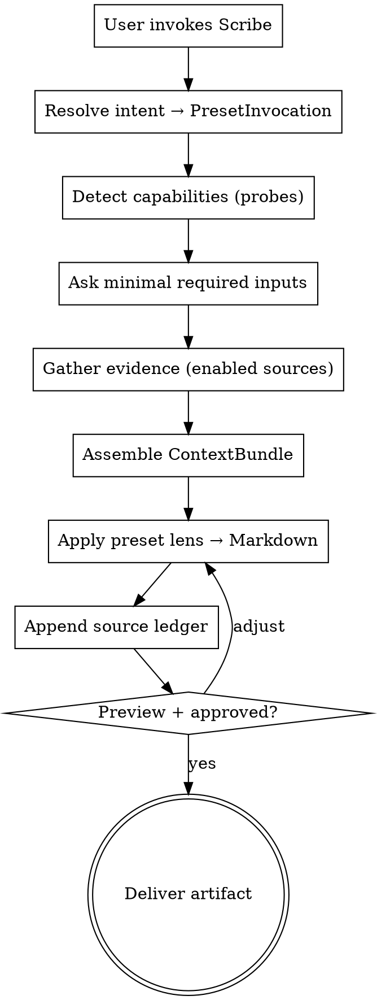

# Scribe

**Core thesis:**

> Daily, weekly, ADR, and handoff look like different tasks, but they are the same operation with different presets.

```
evidence → semantic normalization → preset → artifact
```

The input doesn't change. The preset does.

## Presets as lenses over the same operation

| Preset | Question it answers | Lens |
|---|---|---|
| `daily` | What do I need to communicate today? | short temporal |
| `weekly` | How do I tell the week's story? | long temporal |
| `adr` | What decision needs to become memory? | decisional |
| `handoff` | How do I continue without rebuilding context? | continuity |
| `client-update` | How do I explain progress to someone outside day-to-day execution? | external-facing communication |
| `retro` | What did we learn, and what changes next time? | retrospective learning |
| `loose-ends` | What work is stalled, drifting, or intentionally parked — and what decision is needed now? | triage / hygiene snapshot |

## Usage patterns across presets

Some presets compose naturally, but they must not overlap:

- `weekly` surfaces unresolved WIP briefly as part of period awareness
- `loose-ends` investigates stalled or drifting work and forces decision pressure
- `handoff` packages one selected work item for continuation

Anti-overlap rules:

- `weekly` may mention WIP, but must not do evidence-heavy triage item by item
- use `loose-ends` when the user wants urgency ranking, suspicion rationale, or explicit decision pressure
- use `handoff` when the user wants one item packaged for retake, reassignment, or session continuation

## Why an engine, not a summarization tool

```
Commodity:    git log → summary
Scribe:       evidence → operational briefing → preset → purposeful artifact
```

A summarizer answers "what happened?". Scribe answers what the preset asks. That's the difference between generic summary and **operational artifact**.

## Prompt engineering rules

Scribe is implemented as natural-language instructions, so output quality depends on disciplined prompt engineering.

Apply these rules in every invocation:

- **Progressive disclosure** — ask only the minimum clarifications needed to resolve preset, scope, language, or explicit source requirements
- **Few-shot by example** — before rendering, load the matching `examples/<preset>.good.md` and mirror its section shape and level of specificity, not its domain nouns, product names, or stack assumptions
- **Structure before prose** — first decide sections and item coverage from the bundle, then write the prose
- **Fail closed** — if the preset lacks minimum viable signal, ask or degrade explicitly; do not fabricate momentum, rationale, or decisions
- **Validation before delivery** — run the preset's verification checklist before showing the artifact

## Scribe Engine + Interface Adapters

```
Interface Adapters              Scribe Engine                 Runtime Plumbing
-------------------              -------------                 ----------------
- Skill Adapter (MVP)            - Preset Resolver             - Capability Probes
- CLI Adapter (future)           - Evidence Gatherer           - Source Ledger
- API Adapter (future)           - Evidence Normalizer         - Graceful Degradation
                                 - Preset Renderer

All adapters compile user input → PresetInvocation → engine
```

**The skill is an Interface Adapter** — the first, because it has the lowest adoption friction. It is not the product. CLI, cron, GitHub Action are other future adapters over the same engine.

## PresetInvocation — the engine contract

Every adapter produces this contract (interface-agnostic):

```json
{
  "preset": "weekly",
  "preset_resolution": { "mode": "explicit", "matched_from": "scribe weekly" },
  "audience": "default",
  "source_policy": "auto",
  "source_requirements": {
    "mode": "explicit",
    "requested_sources": ["code_hosting"],
    "matched_from": "based on my code-hosting activity"
  },
  "output_language": "en-US",
  "output_format": "markdown",
  "period": { "label": "this_week", "start": "...", "end": "..." },
  "objective": "prepare weekly update",
  "user_prompt": "..."
}
```

A CLI would produce this via flags (`--preset weekly`). A skill produces it via intent resolution. An API would produce it via payload. The engine doesn't change.

Full schema in [protocols/context-bundle.md](protocols/context-bundle.md) (`request` section).

## Flow (invariant)



## Step 1 — Resolve intent → PresetInvocation

The Skill Adapter compiles intent into a PresetInvocation. Resolution has 3 modes:

| Mode | When |
|---|---|
| `explicit` | User names the preset: "scribe weekly", "/scribe adr" |
| `inferred` | User uses a semantic equivalent: "weekly report" → weekly |
| `clarified` | User was ambiguous; Scribe asked one short question; user resolved |

The Skill Adapter also resolves `output_language` before rendering.
The Skill Adapter also resolves `source_requirements` before gathering evidence.

### Mapping rules

**Explicit (verbatim):**
- `scribe weekly`, `/scribe weekly` → **weekly**
- `scribe daily` → **daily**
- `scribe adr` → **adr**
- `scribe handoff` → **handoff**
- `scribe client-update` → **client-update**
- `scribe retro` → **retro**
- `scribe loose-ends` → **loose-ends**

**Inferred (semantic equivalents):**
- "weekly report", "weekly recap", "what did I do this week", "summarize the sprint" → **weekly**
- "what did I do today", "standup" → **daily**
- "record this decision", "document the decision", "create ADR" → **adr**
- "generate a handoff", "hand off context", "prepare prompt for next session" → **handoff**
- "client update", "stakeholder update", "customer update", "leadership update", "progress update for the client" → **client-update**
- "retro", "retrospective", "what went well", "what should change next time", "lessons learned" → **retro**
- "loose ends", "what is stalled", "what is drifting", "what needs a decision", "what should I close", "what should I reassign", "what's stuck but still marked active" → **loose-ends**

**Ambiguous → ask ONE short question (clarified mode):**
- "summarize what I did" → "Today or this week? (daily / weekly)"
- "document this" → "As ADR (technical decision) or handoff (context transfer)?"
- "status update" → "Internal weekly or external client update? (weekly / client-update)"
- "let's reflect on this" → "Do you want a retro or an ADR? (retro / adr)"
- "what should I do with this WIP" → "Do you want investigation or packaging? (loose-ends / handoff)"
- generic ("help me") → "Which artifact? (daily / weekly / adr / handoff / client-update / retro / loose-ends)"

### Inviolable rules

- **If the user names it, use exactly that preset** — never silently "improve"
- **If clearly inferred, use canonical preset** — record `matched_from` in PresetInvocation
- **If ambiguous, ask** — one short question, do not continue until resolved
- **Never mix templates** — two presets = two invocations, not a hybrid
- When resolved, pass **one single canonical preset** to the renderer

### Output language resolution

Scribe must render each artifact in exactly one language.

Resolution rules:

- **If the user explicitly requests a language, use it** — examples: `"in English"`, `"em pt-BR"`, `"write this in Portuguese"`
- **Otherwise, default to the dominant language of the user's latest request**
- **If the latest request is genuinely mixed and no dominant language is clear, ask one short question** — `"Output in pt-BR or English?"`
- **Never mix languages inside the final artifact unless the user explicitly asks for it**

Store the result in `PresetInvocation.output_language`.

### Explicit source requirements

If the user explicitly asks for a source, Scribe must treat that as a contract constraint.

Examples:

- `"based on my commits in GitHub"` → requested source: code-hosting evidence (`gh` or `github_connector`)
- `"use local git history"` → requested source: `git_local`
- `"based on Notion"` → requested source: a connected workspace/tracker source (`notion`)
- `"just use the current conversation"` → requested source: `conversation`

Rules:

- **If the user explicitly requests a source, record it in `PresetInvocation.source_requirements`**
- **If that source is unavailable in the current surface, stop and ask before fallback**
- **Do not silently weaken the evidence base**
- **If the user approves fallback, record that approval and continue**
- **If the user did not explicitly request a source, normal capability-based source selection still applies**

Example clarification:

> "You asked for a weekly based on code-hosting evidence, but that source isn't available here. Do you want me to continue with connected trackers + conversation instead?"

## Step 2 — Capability detection

Follow [protocols/capability-detection.md](protocols/capability-detection.md). Each source/capability passes a cheap probe; resolves to one of 4 fixed states: `used | missing | denied | error`.

Report to user:
```
Capabilities detected:
  ✅ conversation, git_local, work-tracking connector
  ⚠ secondary connector (not exposed)
  🚫 code-hosting CLI (auth expired)

Preset: weekly (explicit)  |  Proceeding...
```

## Step 3 — Ask minimal required inputs

Load the corresponding preset:
- `daily` → [presets/daily.md](presets/daily.md)
- `weekly` → [presets/weekly.md](presets/weekly.md)
- `adr` → [presets/adr.md](presets/adr.md)
- `handoff` → [presets/handoff.md](presets/handoff.md)
- `client-update` → [presets/client-update.md](presets/client-update.md)
- `retro` → [presets/retro.md](presets/retro.md)
- `loose-ends` → [presets/loose-ends.md](presets/loose-ends.md)

Each preset declares required vs. optional inputs. Ask only what's missing. **One message, multiple questions** — don't drip-feed.

Scribe only asks follow-up questions in two situations:
1. Preset intent is ambiguous (resolved in Step 1)
2. Resolved preset lacks minimum viable signal (e.g., `adr` without a clear decision)

If `output_language` is unclear, resolve it here with one short question before gathering or rendering.
If an explicitly requested source is unavailable, resolve fallback approval here before gathering or rendering.

## Step 4 — Gather evidence

Execute the preset's gathering instructions, respecting the capability manifest. Parallelize independent sources. Each source has `max_items`.

## Step 5 — Assemble ContextBundle

Follow [protocols/context-bundle.md](protocols/context-bundle.md). Normalizes any combination of sources into a single shape (10 top-level fields). Separates `raw` evidence from `items` (normalized operational units).

**Item types** (fixed 9): `work_item | decision | risk | blocker | next_action | artifact_ref | delivery | attempt | open_question`.

Some presets may also rely on optional per-item metadata without introducing new item types, for example:

- `triage_status`: `stale | drifting | parked`
- `recommended_action`: `retake | reassign | close | defer`
- `why_flagged`
- `flag_confidence`
- `last_activity_at`
- `owner`
- `system`

## Step 6 — Apply preset lens

Apply the preset's template. Template is **by example** (`examples/<preset>.good.md`), not abstract spec.

Invariant rules:
- Follow section order exactly
- Use exactly one output language per artifact, from `PresetInvocation.output_language`
- Use the preset's declared tone (plain engineering English by default; may be overridden per preset)
- Inline specifics (change IDs, review IDs, task IDs, links) — not in headers
- Omit sections with no substantive evidence
- **Never list raw evidence** — synthesize via `items`

Renderer workflow:

1. Load the matching canonical example
2. Build a section plan from the bundle
3. Check that each planned section has enough evidence
4. Write the artifact following the preset's exact section order

## Step 6.5 — Validate before delivery

Before appending the ledger, run a short verification pass against the preset checklist.

Minimum checks:

- correct preset and no template mixing
- section order matches the preset
- language is consistent with `PresetInvocation.output_language`
- explicit source requirements were respected
- no claim lacks supporting evidence in the bundle
- no empty/fluff sections remain
- the output answers the preset's question, not a neighboring preset's question

## Step 7 — Append source ledger

Mandatory. Follow [protocols/source-ledger.md](protocols/source-ledger.md). Format:

```
Sources
- used: conversation, git_local
- missing: notion
- denied: atlassian
- error: gh
```

The ledger is emitted deterministically from `sources[]` in the bundle — no LLM reasoning, only lookup. **Hardened by design.**

## Step 8 — Preview + deliver

Show the rendered output. Offer:
- Inline (default)
- Save to `./scribe-<preset>-<timestamp>.md`
- Copy to clipboard (if `xclip` available)
- Suggest a destination if relevant (workspace page, team doc, tracker) — **never auto-publish**

If the user requests adjustments, re-render using the same bundle (don't re-gather).

## Relationship to other tooling

- **Living trackers (e.g. a task/issue tool)** — different lifecycle: the task lives in the tracker and keeps evolving. Scribe generates portable, point-in-time markdown; feeding an existing tracker task afterward is a separate, out-of-scope step.
- **Multi-session orchestrators** — orthogonal: an orchestrator produces work sessions; Scribe reads the traces those sessions leave behind.

## Non-goals (v1)

- No own OAuth — uses existing Claude connectors
- No auto-publish — user confirms destination
- No CLI binary — that's a future interface over the same engine
- No multi-audience in a single invocation
- No template evolution / learning loop
- No complex source framework

## Capability-based, not platform-locked

Scribe is agent-agnostic — it detects capabilities at runtime. It runs in any agent harness that can read skill-style markdown and call tools (Claude Code, Codex, Gemini CLI, custom harnesses). A surface with full filesystem + shell + git gets the rich path; a chat-only surface with connectors only can still run `adr` and `handoff`. New surfaces are mapped by the same protocol — no special-casing.

Runtime plumbing detail in [protocols/capability-detection.md](protocols/capability-detection.md). **Plumbing, not pitch.**
